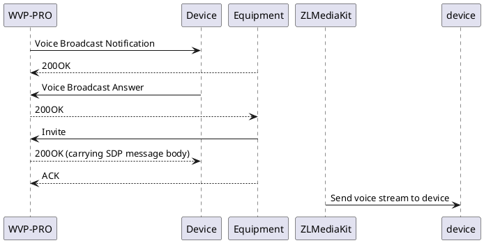

# Voice intercom

## Process and Principle

Voice intercom is divided into two modes: broadcast and talk (intercom) in the national standard 28181-2016. Broadcast mode transmits audio from the server to the device and is one-way.
It needs to be combined with on-demand video to achieve two-way intercom. Talk mode supports two-way, but wvp only handles the same audio transmission device as broadcast, so the two modes can use the same logic processing.
Different devices have different and usually very different support for the two modes. Different devices also have slightly different support for the same device, so compatibility and adaptation in voice intercom are also the most problematic. Since the talk mode has been removed from the national standard 28181-2022, it will not be discussed here.

### 1. Broadcast mode process



Different from the on-demand process, the invite message here is sent by the device to wvp, and wvp pushes the voice stream to the device according to the invite negotiation method. The method (UDP/TCP passive/TCP active) used to transmit the voice stream for all intercoms is determined by the device.

## Conditions and restrictions of use

Because the invite message is sent by the device to wvp, this determines the way to send the voice stream, which also determines that some devices cannot be used for public network intercom. For example, most Hikvision devices only support UDP streaming (
At present, the new version of Hikvision equipment is already working on solving this problem), so when wvp streams can only be sent according to the IP port specified in sdp, so if wvp is on the public network and the device is on the intranet, then wvp cannot connect to the IP provided by the device, and the stream will fail.
Different from Hikvision, Dahua and many law enforcement recorder manufacturers support TCP active mode to obtain streams, which can realize public network intercom.

## Quick test using ffmpeg

Since the browser needs to support https for audio collection, if you want to implement web audio intercom, you must configure certificates for wvp and zlm to use https.
During the testing phase, if you just want to test the function, you can use ffmpeg to simulate the voice stream. After pushing to wvp, you can push the audio file to the camera.
The test command format is as follows:

```shell
ffmpeg -re -i {audio file} -acodec pcm_alaw -ar 8000 -ac 1 -f rtsp 'rtsp://{zlmIP}:{zlm's RTSP port}/broadcast/{equipment national standard number}_{channel national standard number}?sign={md5(pushKey)}' 
```

For example

```shell
ffmpeg -re -i test.mp3 -acodec pcm_alaw -ar 8000 -ac 1 -f rtsp 'rtsp://192.168.1.3:22554/broadcast/34020000001320000001_34020000001320000001?sign=41db35390ddad33f83944f44b8b75ded' 
```

The test process is as follows:

```plantuml
@startuml
"FFMPEG" -> "ZLMediaKit": Push tozlm
"WVP-PRO" <- "ZLMediaKit": Notification of receipt of voice intercom push stream, carrying device and channel information
"WVP-PRO" -> "Device": Start voice intercom
"WVP-PRO" <-- ""Device": Voice intercom established successfully, carrying traffic collection port
"WVP-PRO" -> "ZLMediaKit": Notify zlm to push the stream to the device's stream port
"ZLMediaKit" -> ""Device": push stream to device
@enduml
```

If you hear the device playing the audio you pushed, it means the call is successful. This process of pushing the stream requires calling any interface.

## Initiate voice intercom on the production environment webpage

When using voice intercom in a production environment, if it is your own client device, just use the ffmpeg test method above and push the stream to zlm in a fixed format.
For WEB programs, the main difference is the local area network and the public network, for two reasons:

1. Many devices do not support public network intercom
2. Public networks and local area networks have different ways of obtaining certificates to support https.

### Public network use

On the public network, you can directly use the certificate provided by the certificate vendor or cloud server vendor, which is very convenient.

### LAN use

For LAN, you need to generate self-signed certificates for wvp and zlm. Here I recommend a relatively convenient way to generate self-signed certificates.
This method is a method under linux.
Download the certificate generation tool:
[https://github.com/FiloSottile/mkcert/releases/tag/v1.4.4](https://github.com/FiloSottile/mkcert/releases/tag/v1.4.4)
Install this tool, enter the decompressed tool directory, and execute

```shell
./mkcert-v1.4.4-linux-amd64 -install
```

Generate pem certificate

```shell
./mkcert-v1.4.4-linux-amd64 LAN IP LAN IP2 LANIP3
```

You will get two files *-key.pem and *.pem. After configuring this file to wvp, you can load the certificate.
Generate the certificate used by zlm

```shell
cat *.pem *-key.pem> ./zlm.pem
```

The obtained file is a certificate that can be used by zlm
There are two ways to use certificates under zlm:

1. Replace default.pem under zlm, that is, delete this file and rename zlm.pem to default.pem
2. Add `-s zlm.pem` when starting zlm