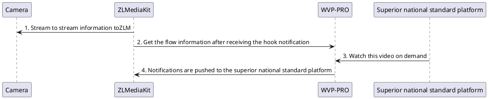

<!-- Streaming agent -->

# Pull streaming agent

Not all cameras support national standards or push streaming, but these devices can get a video playback address, usually rtsp protocol,
Take Dahua as an example:

```text
rtsp://{user}:{passwd}@{ipc_ip}:{rtsp_port}/cam/realmonitor?channel=1&subtype=0
```

You can get such a stream address and play it directly with vlc. At this time, we can push this device to other national standard platforms through the streaming proxy function.
The process is as follows:



## Add proxy

The streaming agent supports two methods:

1. Direct proxy streaming in ZLM supports RTSP/RTMP, but does not support transcoding;
2. Use ffmpeg to complete the pull and transfer. You can complete the transcoding by modifying the ffmpeg pull and transfer parameters.
Click "Add Agent" on the page, add the information and save it. If you need to share push information to other national standard platforms, then you need to edit/national standard channel configuration and configure national standard encoding.

Just add the `PS： ffmpegThe default template does not need to be modified;` parameter to the ZLM configuration file by yourself.
