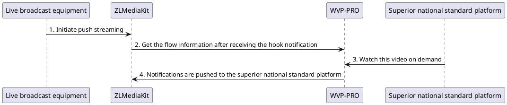

<!-- Push list -->

# Push list

## Function description

WVP supports three image input methods, live broadcast, [Streaming agent](_content/ability/proxy.md) , [National standard](_content/ability/device.md) . The live broadcast device access process is as follows



1. By default, after WVP receives push information, this push information appears in the list. If you need to share push information to other national standard platforms, then you need to edit/national standard channel configuration and configure national standard encoding.
2. WVP also supports importing a large number of channels before pushing and pushing directly to superiors. Click the "Download Template" button. After modifying the template according to the example, click the "Channel Import" button to import the channel data.

## Generate push address
You can click the 'Generate push address' button in the push list and copy the new address directly to the push device.

## Push and pull flow authentication rules

In order to protect the server, WVP turns on push authentication by default (it is currently not supported to turn off this function)

### Push rules

When pushing, you need to carry the signature sign for push authentication, sign=md5(pushKey), the pushKey comes from the user table, and each user will have a different pushKey.
For example, app=test, stream=live, pushKey=1000, ip=192.168.1.4, port=10554, then the push address is:

```
rtsp://192.168.1.4:10554/test/live?sign=a9b7ba70783b617e9998dc4dd82eb3c5
```

Supports customizing the playback authentication Id when pushing streams. The parameter name is callId. In this case, sign=md5(callId_pushKey)
For example, app=test, stream=live, pushKey=1000, callId=12345678, ip=192.168.1.4, port=10554, then the push address is:

```
rtsp://192.168.1.4:10554/test/live?callId=12345678&sign=c8e6e01dde2d60c66dcea8d2498ffef1
```

### Play rules

By default, authentication is not required for playback, but if the callId is carried when pushing the stream, the callId must be carried when playing.
For example, app=test, stream=live, no callId, ip=192.168.1.4, port=10554, then the playback address is:

```
rtsp://192.168.1.4:10554/test/live
```

For example, app=test, stream=live, callId=12345678, ip=192.168.1.4, port=10554 then the playback address is:

```
rtsp://192.168.1.4:10554/test/live?callId=12345678
```

