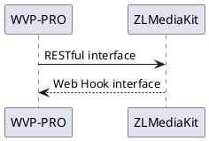

<!-- Configuration -->

#Configuration

For first-time testing or novice students, I recommend testing on the LAN and turning off the firewall test on the server and client. It is recommended to deploy on linux for testing.



WVP-PRO controls the behavior of ZLMediaKit by calling the RESTful interface of ZLMediaKit; ZLMediaKit notifies WVP-PRO of messages through the Web Hook interface. In this way, the interoperability between the two is achieved.
For the simplest configuration, you do not need to modify any of ZLMediaKit's default configuration. You only need the ZLMediaKit information configured in WVP-PRO

## 1 WVP configuration file location

Based on the spring boot development method, the loading of configuration files is very flexible. By default, it is in src/main/resources/application.yml. Some configuration items are optional. You do not need to configure them all in the configuration file.
For complete configuration instructions, please refer to "src/main/resources/configuration details.yml".

### 1.1 Default configuration file loading method

There is already a configuration file in the target packaged with maven. The default loaded configuration file is application.yml. Check the content and find the content of spring.profiles.active configuration. The value of the configuration is dev, then the specific configuration file to be loaded is application-dev.yml. If the configured value cannot find the corresponding configuration file, modify the value to dev.

```shell
cd wvp-GB28181-pro/target
java -jar wvp-pro-*.jar
```

## 2 Configure WVP-PRO

wvp supports a variety of databases, including Mysql, Postgresql, Jincang, etc. You can choose any one for configuration.

### 2.1 Database configuration

#### 2.1.1 Initialize database

First use create database, then use sql/initialization.sql to initialize the database. If it is upgraded from an old version, use upgrade sql to update.

#### 2.1.2 Mysql database configuration

The database name is wvp as an example

```yaml
spring:
  datasource:
    type: com.zaxxer.hikari.HikariDataSource
    driver-class-name: com.mysql.cj.jdbc.Driver
    url: jdbc:mysql://127.0.0.1:3306/wvp?useUnicode=true&characterEncoding=UTF8&rewriteBatchedStatements=true&serverTimezone=PRC&useSSL=false&allowMultiQueries=true
    username: root
    password: root123
```

#### 2.1.3 Postgresql database configuration

The database name is wvp as an example

```yaml
spring:
  datasource:
    type: com.zaxxer.hikari.HikariDataSource
    driver-class-name: org.postgresql.Driver
    url: jdbc:postgresql://127.0.0.1:3306/wvp?useUnicode=true&characterEncoding=UTF8&rewriteBatchedStatements=true&serverTimezone=PRC&useSSL=false&allowMultiQueries=true&allowPublicKeyRetrieval=true
    username: root
    password: 12345678

pagehelper:
  helper-dialect: postgresql
```

#### 2.1.4 Gold warehouse database configuration

The database name is wvp as an example

```yaml
spring:
  datasource:
    type: com.zaxxer.hikari.HikariDataSource
    driver-class-name: com.kingbase8.Driver
    url: jdbc:kingbase8://127.0.0.1:3306/wvp?useUnicode=true&characterEncoding=utf8
    username: root
    password: 12345678
    

pagehelper:
  helper-dialect: postgresql
```

### 2.2 Redis database configuration

Configure the redis connection information in wvp. It is recommended that wvp use a separate db.

### 2.3 Configure the service startup port (the default configuration can be used directly)

```yaml
# [Optional] The HTTP port WVP listens to, web pages and interface calls are all on this port
server:
  port: 18080
```

### 2.4 Configure 28181 related information (the default configuration can be used directly)

```yaml
# Configuration as 28181 server
sip:
  # [Optional] 28181 service listening port
  port: 5060
  # According to the provisions of national standard 6.1.2, domain should use the first ten digits of the unified ID code. Appendix D of the national standard defines the first 8 digits as the center code (composed of provincial, municipal, district and grassroots numbers, refer toGB/T 2260-2007）
  # The last two digits are industry codes. For definitions, please refer to the appendix.D.3
  # 3701020049Identification of information industry access in Lixia District, Jinan, Shandong Province
  # [Optional]
  domain: 3402000000
  # [Optional]
  id: 34020000002000000001
  # [Optional] Default device authentication password. Subsequent extensions will use a device-specific password. If the password is removed, verification will not be performed.
  password: 12345678
```

### 2.5 Configure ZLMediaKit connection information

```yaml
#zlm Default server configuration
media:
  id: zlmediakit-local
  # [Must be modified] Intranet of zlm serverIP
  ip: 172.19.128.50
  # [Optional] If there is a public IP, configure the public IP. Domain names are not available.
  wan_ip:
  # [Must be modified] zlm serverhttp.port
  http-port: 9092
  # [Optional] The IP used by the zlm server to access WVP. The default is 127.0.0.1. This must be configured when zlm and wvp are not deployed on the same server.
  hook-ip: 172.19.128.50
  # [Required] zlm serverhook.admin_params=secret
  secret: TWSYFgYJOQWB4ftgeYut8DW4wbs7pQnj
  # Enable multi-port mode. Multi-port mode uses ports to distinguish each flow for better compatibility. Single port uses the ssrc of the flow to distinguish. For on-demand timeout, it is recommended to use multi-port testing.
  rtp:
    # [Optional] Whether to enable multi-port mode. When enabled, the port will be selected within the portRange range for media streaming.
    enable: true
    # [Optional] Select a port within this range for media streaming. This attribute must be configured on zlm in advance, otherwise the automatic configuration of this attribute may not be successful.
    port-range: 30000,35000 # port range
    # [Optional] National standard cascade selects a port within this range to send media streams,
    send-port-range: 40000,40300 # port range
```

### 2.4 Policy configuration

```yaml
# [Configure according to business needs]
user-settings:
  # On-demand/video playback waiting timeout, unit: milliseconds
  play-timeout: 180000
  # [Optional] Automatically play on demand. When using a fixed stream address for playback, if the playback is not on demand, it will automatically play on demand. Requiredrtp.enable=true
  auto-apply-play: true
  # Whether to record live push streaming
  record-push-live: true
  # Is the national standard recorded?
  record-sip: true
  # National standard on-demand streaming on demand, true: someone is watching the stream, no one is watching it, it is released, false: it is not automatically released after it is pulled up.
  stream-on-demand: true
```

For more complete configuration information, refer to the "src/main/resources/configuration details.yml" file. If you need the configuration item, just copy it to the corresponding file in the configuration file being used.

If the configuration information is correct, you can start zlm and then start wvp to test. If the startup is successful, you can see the prompt that zlm is connected under the wvp log.
Next [Deploy to server](./_content/introduction/deployment.md) , if you only run it locally, just run it locally.
