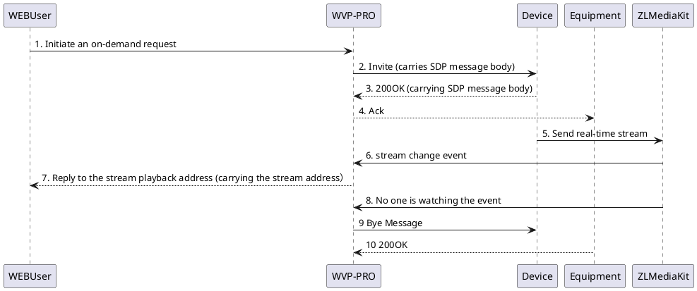
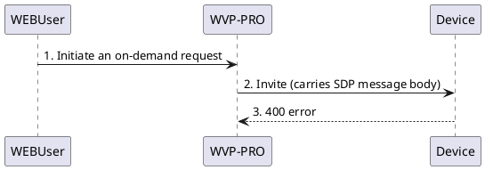

<!-- On-demand error -->

# On-demand error

To troubleshoot on-demand errors, you must first understand [Basic process of on-demand](_content/theory/play.md) . The general process is as follows:

Let’s analyze some common mistakes so that everyone can help them solve common problems.

## On-demand received error code

This error typically manifests itself as getting an error soon after clicking the "Play" button.

1. **400 error code**
When a 400 error occurs, the process usually looks like this:

At this time, the device usually thinks that WVP has sent a wrong message to it. It thinks that the message is incomplete or wrong, so it directly returns a 400 error. At this time, we need [Capture packets](_content/skill/tcpdump.md) 
to analyze whether the content is missing, or you can contact the other party directly to ask why 400 was returned.
WVP cannot guarantee compatibility with all devices. Some devices with non-standard implementation may have the above problems during docking. You can contact the author to help with docking.

2. **500 error code**
Error codes of 500 or greater than 500 and less than 600 are generally caused by problems within the device. There are two solutions. The first is to directly contact the device/platform customer service for a solution. The second is, if you have a platform that is sure to connect to the device, then you can send me the packet capture of the platform and the packet capture of the docking wvp at the same time, and I will try to solve it.

## On-demand timeout

There are roughly two types of on-demand timeouts: on-demand timeouts and streaming timeouts.

1. **On-demand timeout**
The on-demand timeout error is generally a signaling timeout, such as a long time to receive a reply from the other party, which may appear in the process "3. 200OK (carrying SDP message body)
"In this position, that is, we sent an on-demand message, but the device did not reply. Possible reasons:

> 1. Internal device error, failed to reply to message
> 2. The message did not arrive at the device due to network reasons

Most of the time it is due to reason 2, so when we encounter this error, we must first check our network. If you are deploying on a public network, it may be that the heartbeat cycle is too long, causing the routing NAT to fail, and WVP messages cannot be sent to the device through the original IP port number.

2. **Stream collection timeout**
The collection timeout may occur at steps 5 and 6 in the process. Possible reasons are:

> 1. The device sent the stream but to the wrong IP and port, and this information is specified in the sdp of the invite message, which is process 2Invite (carrying the SDP message body)
, and this error is likely to come from your configuration error. For example, you set 127.0.0.1, causing the device network to send traffic to 127.0.0.1, or your WVP is on the public network, but you gave the device an intranet IP, causing the device to be unable to send the stream;
> 2. Internal device error and stream not sent;
> 2. The device sends a stream, but the stream cannot be recognized. This may occur when the stream is not standardized and the network is poor;
> 3. The device sent the stream and zlm also received it, but zlm cannot notify wvp through hook. The reason is that you can check the hook configuration in zlm's configuration file to see if it cannot connect to wvp from zlm;
> 4. The device sent the stream, but SSRC verification was turned on. The device's stream was not standardized enough and used the wrong SSRC, causing zlm to choose to discard it;

My suggested troubleshooting sequence for these possible error causes:

- Turn off ssrc verification;
- Check whether the hook configured by zlm can connect to zlm;
- Check the zlm log to see if there is flow registration;
- Capture packets to check the stream information to see if the stream is sent normally. You can even export and send the original stream and play it with vlc to see if it can be played.
