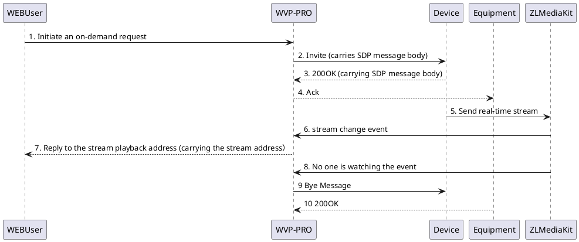

<!-- On-demand process -->

#On-demand process

> The following is the WVP-PRO on-demand process. If there is a problem in any link before the on-demand is successful, the on-demand timeout may occur, which is also the basis for troubleshooting the on-demand timeout.

## The registration process is described as follows:

1. The user initiates an on-demand request from the web page or calling interface;
2. WVP-PRO sends an Invite message to the camera. The message header field carries the Subject field, indicating the on-demand video source ID, the sender's media stream serial number, the IP and port number used by ZLMediaKit to receive the stream,
Receiver media stream sequence number and other parameters, the s field in the SDP message body is "Play" which represents real-time on-demand, the y field describes the SSRC value, and the f field describes the media parameters.
3. The camera replies 200OK to WVP-PRO. The message body describes the IP, port, media format, SSRC field, etc. of the media stream sent by the media stream sender.
4. WVP-PRO replies Ack to the device, and the session is established successfully.
5. The device sends a real-time stream to ZLMediaKit.
6. ZLMediaKit sends stream change events to WVP-PRO.
7. WVP-PRO replies to the WEB user with the playback address.
8. ZLMediaKit sends the stream unwatched event to WVP.
9. WVP-PRO replies Bye to the device and ends the session.
10. The device replies 200OK and the session ends successfully.
