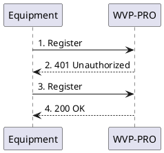

<!-- Registration process -->

# Registration process

WVP-PRO currently only supports the basic registration process described in the national standard, which is also the most commonly used.
> Basic registration uses the digital digest-based challenge response security technology specified by IETFRFC3261 for registration.

> The registration process is described as follows:
> 1. The camera sends a Register request to the WVP-PRO server;
> 2. WVP-PRO sends a response 401 to the camera, and gives the authentication system and parameters suitable for the camera in the WWW_Authenticate field of the response message header;
> 3. The camera resends the Register request to WVP-PRO, and provides a certificate of trust in the Authorization field of the request, including authentication information;
> 4. WVP-PRO verifies the request. If the identity of the camera is legitimate, it sends a success response 200OK to the camera. If the identity is illegal, it sends a denial of service response.
